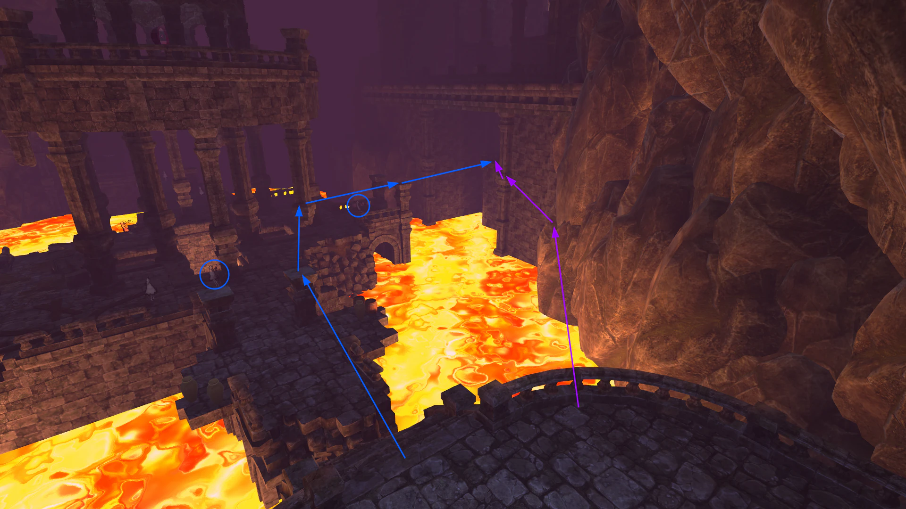

# Little Witch Nobeta - Any% NMG Speedrun Guide

> A guide about speedrunning the game Little Witch Nobeta in the Any% NMG category written by [Eveldee](https://www.speedrun.com/users/Eveldee)

## Table of Content

- [Table of Content](#table-of-content)
- [Introduction](#introduction)
- [Game versions](#game-versions)
- [Settings and controls](#settings-and-controls)
  - [Cursor Indicator](#cursor-indicator)
- [Souls, enemies, stats, ...](#souls-enemies-stats-)
- [Okun Shrine](#okun-shrine)
  - [First Barrier](#first-barrier)
  - [Rescue Cat](#rescue-cat)
  - [Armor Start](#armor-start)
  - [Armor](#armor)
- [Underground Cave](#underground-cave)
  - [Ice Magic](#ice-magic)
  - [Tania Start](#tania-start)
  - [Tania](#tania)
- [Lava Ruins](#lava-ruins)
  - [Fire Magic](#fire-magic)
  - [Bear Start](#bear-start)
  - [Bear](#bear)
  - [Monica](#monica)
- [Dark Tunnel](#dark-tunnel)
- [Spirit Realm](#spirit-realm)
- [Abyss](#abyss)
- [Livesplit and record setup](#livesplit-and-record-setup)
- [Credits and Links](#credits-and-links)

## Introduction

This guide is aimed at anyone that would be interested in trying to play in the Any% NMG (No Major Glitches) category. A lot of information in this guide can be used for other categories but the differences won't be explained here.

> [!IMPORTANT]
> When souls count or mana usage is mentioned, the guide assume that the game is in Advanced difficulty, anything that works in Advanced can also work in Standard.

I highly recommend checking you the movements and combats videos that I made that complement this guide with useful general knowledge, meanwhile this guide focuses more on the route and the content of the run itself.

- [Movements Guide](https://www.youtube.com/watch?v=3ewwr3Cm8EU&list=PLX-WkeHPvTEy8DhkUkb_UUJxz0aRXCtCf&index=1&t=52s&pp=gAQBiAQB)
- [Combat Guide](https://www.youtube.com/watch?v=s0hwn3UjVCI&list=PLX-WkeHPvTEy8DhkUkb_UUJxz0aRXCtCf&index=2&t=20s&pp=gAQBiAQB)

I would also recommend to check the runs on *[speedrun.com](https://www.speedrun.com/little_witch_nobeta)* and to compare them even if they don't necessarily contain the latest techs and routes, sometimes it's easier to understand something with a video example.  
I have also done a complete *[Any% NMG WR Analysis](https://www.youtube.com/watch?v=hlDkyTH6TiM&list=PLX-WkeHPvTEy8DhkUkb_UUJxz0aRXCtCf&index=3&t=6313s&pp=gAQBiAQB)* that explains everything that is right and wrong with the WR in this category *(as of the writing of this guide)*. I will often refer to this video since it is timestamped and provide examples for most of the latest discoveries.

> You can find me on the [Little Witch Nobeta Speedruns discord](https://discord.gg/3FMeB4m) if you have any question

## Game versions

## Settings and controls

First and foremost, 

### Cursor Indicator

## Souls, enemies, stats, ...

## Okun Shrine

Okun Shrine is the first level of the game, it is a short but contains a lot of possible micro-optimizations.

This level starts when you confirm the difficulty setting on the new game screen. You will have two cutscenes to skip in a row which will help you to train your cutscene skip timing. A good time is having a sub 2 seconds timer after the first cutscene.

> _A few notes on skipping cutscenes_
>
> When using keyboard + mouse, you have the choice to either click on the confirm skip button by using the mouse or using the keyboard. Both methods are good and it will really depends on your own feeling and on the situation you are in. For cutscenes after a long loading screen or transition I prefer to use the keyboard, for others I use the mouse.
>
> Be careful of trying to open the skip cutscene menu too fast! It is possible to get in a "softlock" state by opening the menu just after a cutscene starts. Seeing the normal pause menu open instead of the cutscene skip menu is an indicator that you reached this softlock state. The only way to get out easily is to die, which is not necessarily possible in all situations and may make you lose a lot of time. The only way to avoid this is to wait a bit before trying to skip cutscenes. _(Note that some cutscenes can never lead to a softlock, for examples those that are triggered after X seconds like cutscenes after killing a boss)_

### [First Barrier](https://www.youtube.com/watch?v=CHPPDXbgu5s&t=0)

After the two cutscenes, the objective is to reach the first barrier while optimizing your stamina usage (you can refer to [this part of the Movements Guide video](https://www.youtube.com/watch?v=3ewwr3Cm8EU&t=557s) for tips on stamina management).

Firstly, past the statue by going either a bit right or left of it depending on your preferences and then turn right. You want to do as many aerial attacks as possible by jumping off the stairs to save stamina.  
One enemy will launch a projectiles at you, either shoot at him to cancel/kill him or dodge by moving a bit to the left. Then continue past him without stopping until you reach the "lightning trap trigger" _(c.f. image below)_. You should be able to reach this point without having to recover stamina once.

> Collider to trigger the lightning trap, marked by the inner blue collider and the red line

Once you reach this point, you can stop running to recover some stamina but continue moving forward by entering the next corridor. You won't get hit by the lightning traps if you're not running (which you can't do anyway since you need to regenerate stamina). Start running again when you get close to 75% stamina, you can wait for a bit more if it feels easier to you.

Go to the right at end of the corridor, do the two jumps on the platforms and reach the crystal that maintains the magic barrier. The easiest way to destroy this crystal is to jump, do two aerial melee attacks, do an arcane shot and then do a triple melee attacks on the ground followed by another single shot.  

### [Rescue Cat](https://www.youtube.com/watch?v=CHPPDXbgu5s&t=61)

Skip the cutscene after destroying the crystal. Now it is best to get the bag extension upgrade otherwise you won't be able to do a few things later on. To get this upgrade, jump on the crystal pedestal, jump on the stone fence, then jump extension toward the chest directly. Otherwise you find it hard to perform (which it is), you can go back down the stairs and reach the platform using a simple jump extension (double aerial attack after a single jump).

> _Notes on jumping on crystal pedestals_
>
> It can be quite hard at first to jump onto the crystal pedestals while being in a running state. One easy way to achieve this is to do the inputs next to the pedestal in this order: `jump > wait a tiny bit > hold forward > toggle sprint`. The key point is to move forward when you reach the maximum height of the jump, this way you will correctly land on the pedestal instead of jumping over it.
>
> Remember this since it will be used again later in the run.

To open the chest, the fastest way is to open if using the aerial attack that you used to reach this platform. This advanced technique is quite hard to do and not recommended at first. The other standard way is to open the chest using a normal melee attack on the ground and to cancel its animation by shooting a single arcane projectile. This is faster than waiting for the melee animation to end.

Before running again and going down after collecting the bag expansion, be sure to have enough stamina to reach the next cutscene, which requires at least around 60% stamina. Do not jump over the platform, this will waste stamina, instead let yourself fall down.

Go toward the next statue while paying attention to one enemy that can shoot at you, either strafe on a side to dodge (you can use the sound cue to know when to sidestep) or shoot at him to cancel his attack. Go left to go downstairs and run till you reach the big blue mana crystal.

Hit at least once the mana crystal using an aerial melee attack and trigger the cutscene. Skip the cutscene.  
Start charging Arcane and wait to recover a bit of stamina. Once your stamina bar stops blinking red, jump to do two aerial melee attacks on the mana crystal. Jump again to do two more melee attacks. Shoot the charged Arcane when the barrier crystal is about to spawn and land on the ground to charge another Arcane. You then need to jump to do two more aerial melee attacks on the crystal but you need to wait for your arcane magic to be charged before that, otherwise the mana orbs won't spawn. Shoot the charged Arcane while still in the air and then run directly towards the next corridor after the two melee attacks. Shoot the last charged Arcane whenever it is ready. Skip the cutscene.

> [Video example](https://www.youtube.com/watch?v=CHPPDXbgu5s&t=87)

Run towards the next cutscene, the colliders for cutscenes are rectangle so run in a straight line, no need to reposition in the middle of the corridor. Skip the cutscene.

This part can be quite tricky and the placement of the enemies is chosen randomly from a few predetermined patterns so sometimes things don't go well. The gist of this fight is to get the aggro of the two enemies that are attacking the cat, kill the two enemies on the right using headshots, break the jars that contain mana orbs and then finish all the others using a charged Arcane. Using a cursor indicator at the center of your screen will help greatly for this part, see [Cursor Indicator](#cursor-indicator) for more information.

> [Video example](https://www.youtube.com/watch?v=CHPPDXbgu5s&t=111)

### [Armor Start](https://www.youtube.com/watch?v=CHPPDXbgu5s&t=133)

This is the last platforming part of Okun Shrine, leading to the first boss of the game. After the cat rescue cutscene, head upstairs while killing the enemy there (two headshots is enough to kill him). Then jump on the stone fence on the left and jump left around the pillar. If you correctly disable the running state while jumping around the pillar, Nobeta will do a "quick recovery" which allows you to start regenerating stamina way faster than usual when touching the ground. Wait to have around 50% stamina (wait for more if you struggle getting to the Armor without tripping) stamina to start running again.

> Stone fence on the left which you can run on top

Run towards the big enemy with arms and then go to the right. Jump on the stone fence in front of you to go directly towards the last statue without taking the stairs. A good indicator to know where to jump to get over the fence is to jump just before the "lighter stone" on the ground, the one that has a touch of white. Use a jump extension after jumping over the barrier to save your stamina and go around the statue down the stairs. End with another jump extension down the stairs to reach the cutscene trigger, bonus point if you manage to use the trip animation to trigger the cutscene since Nobeta's velocity during the trip animation is higher than when running.

### [Armor](https://www.youtube.com/watch?v=CHPPDXbgu5s&t=171)

This is by far the easiest boss in the game but the randomness of the fight may make you lose a bit of time and you can't really do anything about it. This boss has a weakpoint that you will need to aim at: the base of his body (the purple flame). It is also easy to stagger this boss using Arcane shots so that's a reliable way to kill him easily without any specific strategy.

The fastest strategy is:
- Shoot the left jar on the left wall and charge Arcane. Pray for Armor to do an attack that will allow you to easily hit his weakpoint (best one is the charged slash).
- Shoot the charged Arcane at his weakpoint and immediately destroy the left jar on the right wall.
- Profit from the fact that he's staggered to shoot a few non-charged Arcane shots at his weakpoint (6 shots is ideal).
- Start charging immediately and do a triple melee attack combo
- Shoot the charged Arcane whenever possible while aiming at the jar behind the boss on the left (the charged Arcane projectile will go through the boss and break the jar if aimed correctly)
- Shoot twice with non-charged Arcane shots (you can sometimes shoot a third time here but if you're too slow the boss will enter in a defensive state which you don't want to happen)
- Start charging Arcane and do three melee attacks
- Shoot the last charged Arcane as soon as possible
- Finish the boss using non-charged Arcane magic if he's low, otherwise charge another Arcane

> [!NOTE]
> For this strategy to work, you need to hit the correct jars since for each group of jar, one of them gives more mana than the other. Always break the one with the most mana (or even both).
>
> For some reason the Armor sometimes waits 2-3 seconds before starting any attack pattern, that's why the linked split is +3.1 sec from best split although it is nearly perfect.

Congratulations, you already completed one of the six levels of the game!

## Underground Cave

This is the second level of the game, the objective in this level is to get the Wind, Arcane and Ice magic books before proceeding to the boss. There is still no fast way to kill enemies and they don't give a lot of souls so killing them is not a priority.

### [Ice Magic](https://www.youtube.com/watch?v=CHPPDXbgu5s&t=212)

This level starts with a cutscene just after the loading screen, skip it. Turn around after skipping the cutscene and head to the chest containing Wind magic, open it and pick up the book. Same as for the first chest, you can either use an aerial attack or a cancelled melee attack on the ground to open the chest, use the one you're most used to, the timesave is negligible.  
Since we run in **Load Removed Time**, the timer pauses during loading screens. This is why the best thing to do after getting Wind magic is to open the pause menu and Return to Statue (you can open the menu the exact moment you see the message appear on the top right corner of the screen when picking the magic book). This way you will be back to the start of the level directly instead of having to run back.

After the loading screen, start running directly without waiting for the screen to fade out (yes, it is possible to move while the black fade out animation is still going, try to "feel" the right moment to start running, it's possible to do that after most of the loading screens). Double jump over the obstacle and then follow the path. Do not talk to the cat as of now, we'll pick up the absorption magic book later in the level. Continue on the left until you reach a widder cave. Instead of going right, jump over the stone pillars on the left _(c.f. image below)_ and run until you are next to the falling rocks. Do not go too far or else you will be damaged by the falling rocks and fall back. Destroy newly appeared wall by shooting Arcane magic at it, wait a bit to recover some stamina _(~80%)_, then go up the stairs. Once up the stairs, pass by the big enemy and jump over the small pit, then follow the path until the next big cave.

> Shortcut to the falling rocks by jumping over the small obstacle on the left

Just after the last wooden platform, go to the left and do a double jump extension `jump > double aerial melee attack > jump > double aerial melee attack > stop sprint` to reach the chest for Arcane magic. If you are low on stamina at the wooden platform, stop running and wait to recover a bit to avoid falling down before the jump (would be quite unfortunate). Destroy the two dolls to get a few souls, open the chest, pick up the Arcane magic book and either go around left or right while recovering stamina _(~80%)_. This part can be quite tricky and going left or right is equivalent in difficulty. The goal is to fall down and pick up the Ice magic book in the chest, but, there are a lot of enemies that can hit you while you're picking the book, cancelling the pickup animation. The two enemies on the ledge above can shoot projectiles at you and are the most likely to cancel you. They will first lock onto you when you are falling down and then wait a bit before shooting. This means that there are two possibilities, either pickup the book before they shoot at you, or wait, dodge both projectiles and then pickup the book. Find you own timing by training it multiple times and stick with it, consistency is key for this segment.

### [Tania Start](https://www.youtube.com/watch?v=CHPPDXbgu5s&t=283)

Once you have Ice magic, turn around and follow the path on the right then follow the path that goes up. Ignore the enemies on the way. Remember to equip Ice magic at some point before reaching the top of the path. When reaching the top, check if you still have enough stamina and do another double jump extension on the left to reach the next two enemies. Kill them using headshots with Ice magic while walking to recover your stamina. After killing them and with enough stamina _(~50%)_, follow the path until the blue light on the right _(c.f. image below)_, at which point you need to stop running and to charge Ice magic.

> Blue light that indicates the point at which Ice needs ot be charged

You can start running again when you reach around 50% stamina, lock onto the two stone crystals on the right and on the left while still running towards the barrier. Reach the stairs, cast your charged Ice magic _(this will disable the running state)_ when you're on the stairs, start running again and shoot at the third stone crystal directly using non-charged Ice attacks _(you can hold the shoot button)_. Try to end up where the absorption book will spawn _(c.f. image below)_ before the cutscene starts.

> Absorption book spawn position

Skip the cutscene. After the cutscene, wait for the cat to move _(to avoid talking to him)_, pick up the book and dodge directly towards the stairs to avoid a potential attack, start charing Ice magic. Continue running up the stairs towards the statue while ice magic is charging, Pray to the statue once you reach it and Ice magic is charged. It is a requirement to charge Ice magic here to gain a shield that will avoid you getting cancelled by the enemies while trying to Pray to the statue. Go into the Enhance Abilities menu and upgrade Intelligence to level 6. Use the pause menu button to directly leave the statue without having to press Return twice.

> Stats before leaving the statue

Jump directly over the fence in front, then take either left or right at the circular corridor. Stick to the wall to optimize your trajectory. Trigger the cutscene, skip it. Run backward (or turn around), jump and hit the mana crystal twice, jump again and hit it only once. Start charging Ice magic while walking towards the flames, start running again when reaching max stamina. Try to save as much stamina as possible while going up the stairs. Break the crystal by using a triple melee attack combo on the ground. Skip the cutscene.

Wait to reach around 80% stamina, jump on the pedestal and double jump then extension to reach the platform in front. Continue in a straight line until the stairs. Here you have two choices: either kill the enemies downstairs to disable the magic barrier or try the barrier skip. I will only explain the barrier skip here.  
For the barrier skip, you will need to jump onto the arches on the sides (left or right, there's no difference). What I like to do is jump directly over the corner stone support half down the stairs and then jump onto the right arch. Then I double jump of the arch followed by the two aerial attacks directly, all this while moving a bit on the left without moving the camera.

> [Video example](https://www.youtube.com/watch?v=yjl-kI6HbXw&t=449s)

This skip is a question of feeling, try out different things and stick to the one that is the easiest for you, no method is better than the other.

After skipping the cutscene, head to Tania by going in a straight line in front of you (you can jump on the fence) and then on the right, ideally taking this chance to kill the enemy on the ground. Jump down and trigger the cutscene to start the fight against Tania.

### [Tania](https://www.youtube.com/watch?v=CHPPDXbgu5s&t=421)

This boss fight is the last real bit of RNG in this run but it is also the biggest one. Depending on which pattern she does, you may lose up to 20 seconds.

The goal of this fight is just to do as much damage as possible by using charged Ice attacks. For this, you will need to learn how to parry most of her attacks, or at least to dodge them. There are also a few jars on the right wall that contains some mana orbs, you can destroy them when Tania isn't attacking and you are low on mana. Most patterns will give you a fully charged Ice attack directly if you parry them, meanwhile two of them can give you two charged Ice attacks.

The first of these two patterns is the one where Tania gives three punches and then slams on the ground, parry the first or second punch to charge one attack, and then parry the slam on the ground to get a second charged Ice attack. The second pattern that can give two charged Ice attacks is the one she uses when entering her second phase, she will first charge an attack that will hit in a big aoe around her, which you can parry to get one charged attack, and then three blue projectiles will spawn. Countering or destroying these orbs using non-charged ice magic will give enough mana to charged another Ice attack. As for the laser attack, I prefer to just dodge in the direction of the laser instead of trying to counter it, if done correctly it gives a fully charged Ice attack without having to counter.

Always try to hit Tania with non-charged Ice magic between her attacks, especially if your mana bar is full, not used mana is wasted mana. You don't necessarily have to aim at her head hitbox since it is really small, it's better to hit all of your projectiles in her body than miss a few of them trying to aim at her head. In fact, the damage multiplier for headshots is too small to be worth the required accuracy.

> _Notes on cancelling the counter animation_
>
> It is possible in this game to cancel the end of the counter animation to gain back control of Nobeta a bit faster. While this could be thought as something you should do every time, this is not the case! Especially for this fight. The reason for that is that cancelling the end of the counter animation will also cancel the mana regeneration effect. This means that you will recover less mana if you cancel the end of the counter animation.  
> Mana being really scarce in this fight, it is worth to wait for the animation to end against Tania. Nonetheless, you will want to cancel the animation against Monica, and the best way to do this is to do a "backward dodge", meaning that you have to dodge without pressing any direction input. This way the dodge animation will be faster (just a small back hop instead of a full roll).

At the end of the fight, wait for the cutscene, skip it, and then run directly towards the door in a straight line as fast as possible, without letting the time for the souls to reach you. Note that you cannot interact with the door while running, this means that you will need to cancel the running state when reaching the door. You may ask why is so important to reach the door as fast as possible? This is because we're exploiting a bug in the game that makes all souls obtained during a loading screen count twice their value when playing in Advanced (no change in Standard as far as I know). If done correctly, you should have around 900 souls at the start of Lava Ruins.

## Lava Ruins

Lava Ruins is probably the hardest level in this run because any death before Monica will take you back to the beginning and falling in the lava means instant death. This is also the first level where we start killing enemies.

### [Fire Magic](https://www.youtube.com/watch?v=CHPPDXbgu5s&t=502)

The first thing to do is to get Fire magic, but before that we need to upgrade our stats. At the start of Lava Ruins, move forward to trigger the first cutscene, skip it and then Pray to the statue. Here you need to take at least Strength 3, Stamina 5, and Intelligence 14 the rest is up to your preferences. I usually take a bit of mana (lvl.4) and more stamina (lvl. 7).

> Example stats before leaving the first Lava Ruins statue

After leaving the statue, run straight forward to the stairs and then turn to the right. You are going to enter what I call the cross intersection. There are two different ways to pass this room.  
The first method is to kill the first enemy in front of you while going down the stairs _(the one circled in blue on the left)_, shooting once at the enemy on the far right _(the one circled in blue on the right)_ to get his aggro and then jumping on the platforms at the center to reach the room on the right directly. This is the easiest setup because it nullifies the chances of an enemy staggering you and making you fall during the jumps. This path is drawn on the image below in blue.  
The second method is to jump onto the rocks wall on the right by doing a double jump extension with an added aerial melee attack before or after the second jump. Then once you reach the correct position against the wall you will be able to climb towards a pillar to then jump to the room on the right. This can be quite hard to do since there is no obvious visual guide on where to land on the wall and missing the jump extension leads to falling into the lava. This path is drawn on the image below in purple.

> Cross intersection room with both possible paths shown

When entering the next room, climb up the first stairs and kill the flying enemy then continue to go upstairs while breaking the two jars on the right. Destroy the wood floor by shooting Ice magic projectiles at it, start charging Arcane and fall down (do an aerial melee attack just before touching the ground to avoid the recovery animation). A big doll will spawn, shoot charged Arcane magic twice at it since you should have Arcane lvl.2 at this point, charge another one Arcane by using melee attacks against the big doll. Use it against the doll and then finish her off using non-charged Arcane or Ice magic. Wait for the barrier to disappear, follow the corridor (the one without a stone crystal), then go to the right at the next intersection and continue forward until you trigger the next cutscene. Skip it.

Now we're going to get Fire magic. Follow the path on the left and kill the doll on the ground that is waking up using non-charged Ice magic. Break the two jars on the right and start charging Ice magic. Hit the doll you just killed using two or three melee attacks to charge faster. Go down the stairs towards the Fire magic book chest while trying to lock onto the flying enemy and the two enemies around the blue mana crystal. Kill any of them using non-charged Ice magic if you couldn't lock onto them. Go to the chest, open it, pickup Fire magic. Turn around, kill the enemy that just appeared in front of you using non-charged Ice magic. Swap to Fire magic, hit the big mana crystal twice using aerial melee attacks, go to the right up the stairs and start charging Fire magic. Lock onto the enemy in front of you and then trigger the magic barrier by walking to the left and start recovering your stamina while walking towards the stone crystal that is going to appear. Bait the big enemy attack and then run towards the stone crystal to destroy it using aerial Fire melee attacks. Shoot the charged Fire attack directly after destroying the crystal, killing the big enemy behind you.

> [!NOTE]
> There is a new method to do this room which is a bit faster and exploit the fact that the collider to trigger the magic barrier goes below the floor and is thus accessible from below. Here is [a video example of it](https://clips.twitch.tv/SmoothPatientEndiveLeeroyJenkins-6CjIPgNpMKKrjVok). I won't explain this one in details since it is quite hard to do and has not been used in a run as of now.

### [Bear Start](https://www.youtube.com/watch?v=CHPPDXbgu5s&t=637)

This part that leads to the "crystal ride" is quite straightforward: take the first path to the left after the room where you just destroyed the stone crystal, jump to the right onto the platform then go right, kill the two enemies there while recovering your stamina _(~60%)_, jump on the left while dodging the maid doll attack (try to be as much on the right as possible to dodge her attack), shoot the enemy directly on the ground on your right using Fire magic, jump over the small pit, kill the enemy that is waking up and then follow the path to the big blue mana crystal which I call the crystal ride.

Again, there are a lot of ways to do this part. I am going to explain the one I use, this is the fastest but hardest method. I will link a video example below of the other method that is a bit easier.  
Start by activated the crystal ride, charge Ice and use two times two aerial melee attacks against the crystal. Lock onto the first two enemies, cast and charge Ice again using four aerial melee attacks just as before. Lock onto the only enemy on the left, cast and repeat charging Ice another time with four aerial melee attacks. Finally, lock onto the last two enemies, charge Ice and start running directly when you reach 100% stamina in the direction of the crystal ride. The timing of this part will always be right if you followed the previous instructions, there is no need to wait. Do a double jump extension and land onto the stone ledge on the left using the momentum the crystal ride gave you. Make sure to reposition yourself on the ledge and then jump to the next one. Jump onto the third one. Jump on the platform on the right while locking the flying enemy, then jump again and lock onto the second enemy next to you. Go around the ledge on the right and jump to the last one. Jump towards the end of the crystal ride and cast the Ice magic whenever you are above land. Shoot at the enemy on the left while recovering a bit of stamina _(~60%)_. Follow the path upstairs until the next stairs. Break the jar on the left containing a mana Meager Magic Crystal then Pray to the statue. You've done the hardest part of Lava Ruins!

> [Video example of the easier method](https://www.youtube.com/watch?v=_unusw_wgaA&t=682s)

At this statue you want to take at least 2 or 3 purple crystals and if you have enough souls go for Intelligence 16. After leaving the statue, jump over the lava to the right and follow the path. Shoot as early as possible at the big doll using non-charged Ice magic to make her start an attack. In most cases you will be able to dodge her attack by just running past her, otherwise you will have to dodge. Climb up the stairs and trigger the cutscene to the next boss. Skip the cutscene.

### [Bear](https://www.youtube.com/watch?v=CHPPDXbgu5s&t=752)

This boss fight is similar to Tania, parry as many attacks as possible to use more charged Ice attacks. Use non-charged Ice attacks whenever possible between the Bear attacks. A lot of patterns allow to cast two charged Ice attacks and the Bear tends to attack more so this fight is way less random than the one against Tania.

One thing to note is that you need to be close to the Bear when he does the attack where he charges one ground projectile per hand and throw them at you. If you're not close to him during this attack, you will get way less mana from the counter. It is also possible to counter the attack where the Bear slams the ground and make you fall if you are in melee range. This is because the "shockwave" can't be parried since it doesn't do damage but the slam with his hands in itself deals damage.

Knowing when to charge and when to shoot directly is key to optimizing this fight. Note that when you will want to charge again after a charged attack, you will need to wait a small delay and the charge input cannot be buffered so it can be missed. To avoid this, always shoot once with a non-charged attack and then charge, this way the charge input will always correctly register. You may also drop a purple crystal on the ground to recover more mana, allowing you to shoot more non-charged attacks if you tend to be low on mana during the fight.

> [!TIP]
> It is not possible to counter while taking damage, this means that you will need to get out of any lingering fire on the ground before being able to counter any attack.

### [Monica](https://www.youtube.com/watch?v=CHPPDXbgu5s&t=800)

This fight has the particularity of being always the same in the sense that Monica will always do the same attacks in the same order. The only thing that can happen is that if you do not do enough damage after the first cycle, she will repeat the same cycle instead of doing the second one, which usually should not happen once you know how to damage her efficiently. If done correctly, Monica should always die when exploding the second sphere she charges.

The main point of this fight is to burn through your mana as much as possible since countering any of Monica's attack will recover a lot of mana. You can use either Fire or Ice magic (always in the head) to achieve this, I personally prefer to use Fire since it is either to be consistent with it (you can count the number of non-charged attacks you have to do). Always charge an attack before countering and use non-charged attacks between Monica's attack.

So how is it possible to save time in this fight since she should always die at the same attack and the fight has no rng? It will depend on how long you wait before exploding her two charged spheres, indeed, the damage increases the more you wait. One thing to know is that the second sphere is charging way faster than the first one, so you should always wait for the second one to be fully charged, which will deal 3600 damages. I always try to wait for at least 2000 damages on the first sphere, which should be enough to kill her on the second one directly if the rest of the fight is done correctly. This number will depend on how you do the fight, it may be more or less, find a value you are confortable with.

Here is a rundown of how I do this fight know that you know the mechanics behind it.

Start of the fight:
- Drop a purple crystal on the ground directly after the cutscene
- Charge a Fire attack using a purple crystal, use a second purple crystal before shooting
- Shoot the charged Fire attack in the lava, this will hit Monica
- Charge a second Fire attack with the mana orbs from the previous purple crystal
- Shoot the second charged Fire attack at Monica

First cycle:
- Start spamming non-charged Fire attacks on cd
- Use your mana crystal whenever you can't use Fire anymore
- Charge fire, counter her first attack, cancel by dodging with a back hop
- Continue to shoot at her with non-charged Fire attacks
- Optionally use non-charged Ice attack to squeeze the last remaining bits of mana before her next attack
- Charge Fire, counter, cancel by dashing forward, shoot the charged attack
- Do three non-charged Fire attacks, swap to Ice
- Shoot at the sphere using non-charged Ice attacks with a small delay between each attack, do not hold the shoot button.
- Adjust the delay to get the amount of damage you want (I try to get at least 2000 damages here)

Second cycle:
- Charge Fire, shoot it at her legs (her body is immune during the recovering animation!)
- Shoot three times non-charged Fire attacks
- Bait her attack by going to the right of the arena
- Start running to the left after she throws the first projectiles while circling backwards
- Charge Fire, shoot it at her
- Move to the back of the arena to be able to counter he next attack consistently (the projectiles may pass above you otherwise if you're too close to Monica)
- Charge Fire, counter the projectiles
- Dash forward to cancel the counter animation and shoot the charged Fire at Monica

Second sphere:
- Shoot non-charged Fire attack, swap to Ice and shoot around 5 projectiles
- Swap back to Fire, shoot one non-charged attack
- Finally swap to Ice again to destroy the sphere, killing Monica
- If Monica is not dead after the sphere explode, use the mana orbs that just spawned to end the fight

> [!TIP]
>
> The last part of the fight is using a technique that I named "quick-swapping", it exploits the fact that the game use an independent timer for each magic, meaning that while you are waiting for the Fire cooldown, you can use another magic like Ice. Quick-swapping can be hard to execute and is nearly impossible to do on a controller without using external hardware _(Robert_Ordis is using foot pedals for that)_, so instead you can just shoot non-charged Fire attacks twice and then switch to Ice to break the orb. It is a bit slower but way easier to perform.

After killing Monica, skip the cutscene and follow the path to the teleporter, then follow the cat to Dark Tunnel (if you're fast enough you can pass the cat and run in front of him!).

## Dark Tunnel

## Spirit Realm

## Abyss

## Livesplit and record setup

Now that you are ready to start running the game, don't forget to setup Livesplit and a recording software to be able to submit your times on *[speedrun.com](https://www.speedrun.com/little_witch_nobeta)* !

It is best to simplify the work of the moderators on *[speedrun.com](https://www.speedrun.com/little_witch_nobeta)* to setup Livesplit correctly with the autosplitter to display the *Load Removed Time* which is the time without counting all the loading screens to make it fair for everyone since loading times vary greatly depending on the hardware your playing on.

There are a lot of guides on how to setup Livesplit but the gist of it is:
- Create the splits and enable the Autosplitter by setting the game title to "Little Witch Nobeta" in the splits edit menu
- Create or use an existing layout which can be personalized to your preferences

A video proof of your run is also required to submit a run on the leaderboard, you can use any software to record your game but I would recommend to use [OBS (Open Broadcaster Software®)](https://obsproject.com/fr/) as it is free, open source and easy to use while being highly customizable if you're a more advanced user.

## Credits and Links

- **[NobetaTrainer](https://github.com/Eveldee/NobetaTrainer)**: A must-have to train and practice anything!