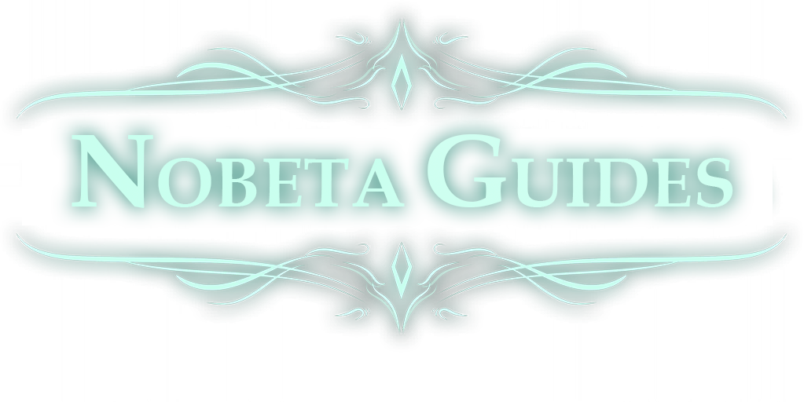

> A collection of Little Witch Nobeta guides

## General Guides

- [Movements Guide](https://www.youtube.com/watch?v=3ewwr3Cm8EU) - A video guide explaining everything that needs to be known about movements in this game
- [Combat Guide](https://www.youtube.com/watch?v=s0hwn3UjVCI) - A video guide to help mastering combat mechanics in this game

## Speedrun Guides

- [Any% NMG Complete Guide](./Any%25%20NMG/README.md) - A (mostly) complete and up-to-date text guide for the Any% NMG (Advanced) speedrun category
- [How to beat the Little Witch Nobeta WR?](https://www.youtube.com/watch?v=hlDkyTH6TiM) - An Any% NMG (Advanced) run analysis

## Tools

- [NobetaTrainer](https://github.com/Eveldee/NobetaTrainer) -  A Little Witch Nobeta tool to help train speedrunning
- [Vanessave](https://github.com/Eveldee/Vanessave) - A Little Witch Nobeta save and settings editor 
- [Autosplitter](https://github.com/ShinRunner1st/LWN-ASL) -  Auto Splitter for Little Witch Nobeta 

## Links

- [Little Witch Nobeta Speedruns Discord](https://discord.gg/3FMeB4m) - Community discord with a lot of information, resources and helpful members
- [Speedrun.com leaderboard](https://www.speedrun.com/little_witch_nobeta) - Official Little Witch Nobeta speedrun leaderboard

<!-- Fix style when printed to HTML -->
<link rel="stylesheet" href="/Resources/fix.css">